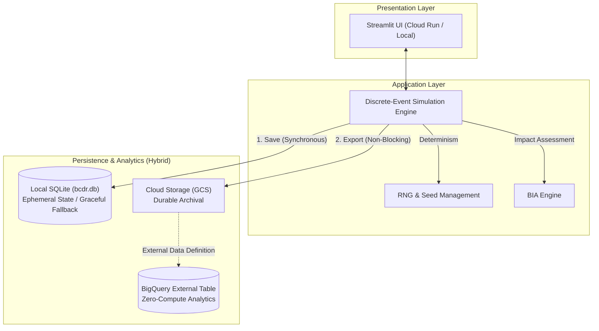

# BCDR Simulator

The BCDR Simulator is an interactive, discrete-event simulation platform for evaluating Business Continuity and Disaster Recovery (BCDR) strategies. It deterministically models how technical failures propagate through a dependency graph and assesses their impact on business services, RTO/RPO targets, and Maximum Tolerable Period of Disruption (MTPD). 

This project is built using a **Cloud-Native Architecture** emphasizing **Resilience Engineering**, **Fault Propagation Simulation**, and **Graceful Offline Degradation**.

## 🏗 Architecture Overview

The system employs a hybrid persistence model and a zero-compute Serverless analytics pipeline:



### Architectural Principles
- **Deterministic Simulation**: All events, scoring, and resolutions are reproducible using discrete RNG seeding.
- **Hybrid Persistence**: Run data is saved locally to SQLite first, then exported to Google Cloud Storage (GCS). This ensures that the application never crashes if network or GCP credentials fail (Graceful Offline Degradation).
- **Serverless Analytics**: We use a **BigQuery External Table** directly mapped to the GCS export bucket. This provides immediate, schema-enforced analytical queryability over historical simulation runs without requiring active ingestion pipelines.
- **Secure Cloud Run Deployment**: The application is deployed in a stateless Cloud Run container using Single Concurrency (`--concurrency=1`) to eliminate write collisions on the ephemeral SQLite database. The deployment maintains least-privilege IAM isolation.

---

## 🚀 Setup & Execution

### Option 1: Local Python Execution

Ensure you are using Python 3.14+ (the current workspace version).

1. Create a virtual environment and install dependencies:
   ```powershell
   python -m venv .venv
   .venv\Scripts\Activate.ps1
   pip install -r requirements.txt
   ```
2. Run the application:
   ```powershell
   .venv\Scripts\python -m streamlit run app/main.py
   ```

### Option 2: Docker Execution

1. Build the image:
   ```powershell
   docker build -t bcdrsimulator:local .
   ```
2. Run the container:
   ```powershell
   docker run --rm -p 8501:8501 bcdrsimulator:local
   ```

---

## 📉 FinServe Demonstration Scenario

The application automatically seeds a `bcdr.db` with the FinServe Demo configuration on startup. Follow these steps to demonstrate the cascading failure and BCDR recovery workflow:

1. **Review Infrastructure**: Navigate to the **Dependency Graph** tab to observe the pre-configured FinServe architecture (Gateways -> Firewalls -> Apps -> DBs -> Replicas).
2. **Inject Fault**: Go to the **Simulation** tab and click **🚨 Trigger Disaster** to simulate a Primary Database Failure.
3. **Observe Propagation**: Note how the failure cascades to dependent systems (e.g., Payment Processing and Customer Portal).
4. **Analyze Business Impact**: View the **Dashboard** to see the Impact Flow Sankey diagram and the RTO/MTPD Bar charts reflecting the current outage.
5. **Execute Recovery**: In the **Simulation** tab, click **⏩ Run Until Empty** to step through the automatic recovery actions and scoring penalties.
6. **Persist Simulation**: Once the simulation completes, click **💾 Save Run**. This writes to local SQLite and transparently exports to GCS.
7. **Audit the Ledger**: Navigate to the **Historical Runs** tab to view the immutable ledger and final business outcome.
8. **Evaluate Strategies**: Navigate to the **Strategy Comparison** tab to analyze deterministic trade-offs between "Restore from Backup" vs "Failover to Replica".

---

## ✅ Testing & Reproducibility

The project maintains a rigorous, fully automated test suite comprising 76 unit and UI integration tests (`AppTest`).

```powershell
.venv\Scripts\python -m pytest tests/ -v
```

Tests cover core simulation logic, deterministic graph traversal, persistence, UI rendering, and GCP authentication/network failure mocks ensuring the graceful degradation architecture is structurally sound.
